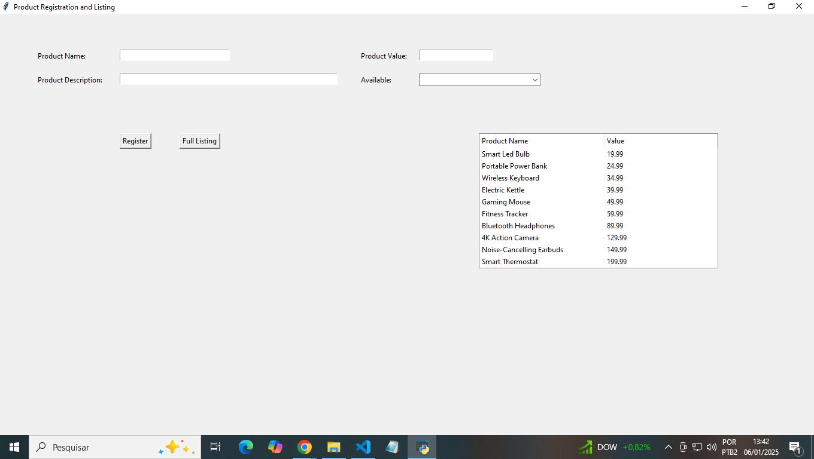
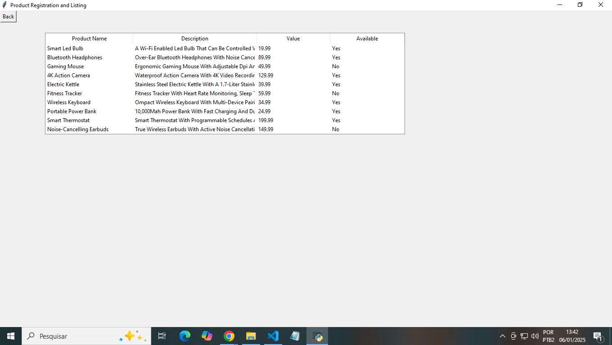

# Product Registration and Listing System
## Overview
This simple system allows users to register products with details like name, description, value, and availability. It stores this data in a SQLite database and provides two main functionalities:

1. **Registering new products.**
2. **Displaying all registered products or displaying a sorted listing by value.**

This project was originally developed as part of an assessment for a job position. It serves as an example for others to modify or extend as needed.

## Features
**Product Registration**: Allows users to add a product with its name, description, value, and availability.

**Product Listing**: Displays a full list of registered products in a table.

**Sorted Listing by Value**: Shows a simplified view of products sorted by their value.

## Technologies Used
**Python**: The programming language used for developing the system.

**Tkinter**: A built-in Python library for creating graphical user interfaces (GUIs).

**SQLite**: An embedded database used to store product information.

**ttk (Tkinter Treeview)**: A component of Tkinter used to display data in a table-like format.

## Setup
### Prerequisites
Make sure Python is installed on your machine. You can download it from the official Python website.

### Installation
1. **Clone the repository or download the Python script**:

  ```bash
  git clone https://github.com/mes231/product-management-system
```
2. **Install the required dependencies (if any)**: This project uses only built-in libraries, so there is no need for external installations.

3. **Run the script**:
  ```bash
  python product_manager.py
```
### How to Use
1. **Run the application**: Launch the script to open the graphical user interface.

2. **Register a Produc**: Fill in the fields for product name, description, value, and availability, then click on the "Register" button.
3. **View Product Listings**:
   * Reduced Listing:
     
       ** This list is displayed directly on the main screen, alongside the registration form.
     
       ** Content: Shows the name and price of the products.
     
       ** Update: The list updates automatically each time a new product is registered.
     
       ** Sorting: The list is sorted by price, from lowest to highest.
     
  * Click on the "Full Listing" button to view all registered products in a detailed table.
  
### Screenshots




### Database Information
The system uses an SQLite database stored as ```database.db```. The database contains a single table ```produtos``` with the following columns:

  ```nome```: Name of the product.

  ````descricao````: Description of the product.
  
  ````valor````: Value of the product.
  
  ````disponivel````: Availability of the product (Yes or No).
  
The database will be created automatically if it doesn't exist in the directory where the script is executed.

## Example of Use
1. **Adding a product**:

  * Name: "Laptop"
  
  * Description: "High-end gaming laptop"
  
  * Value: "1500.00"
  
  * Available: "Yes"
  
2. **Displaying products**: After registration, you can view the full listing or sorted listing by clicking the respective buttons.

## Notes
  * Ensure that the database.db file is located in the same directory as the script, or it will be created automatically upon running the program.
    
  * You can modify or expand the system to add more features, such as product editing or deleting, depending on your requirements.
  
## Contributing
Feel free to fork this repository and modify it as needed. If you find any issues or have suggestions for improvements, don't hesitate to submit a pull request or open an issue.

## License
This project is open-source and available under the MIT License.
